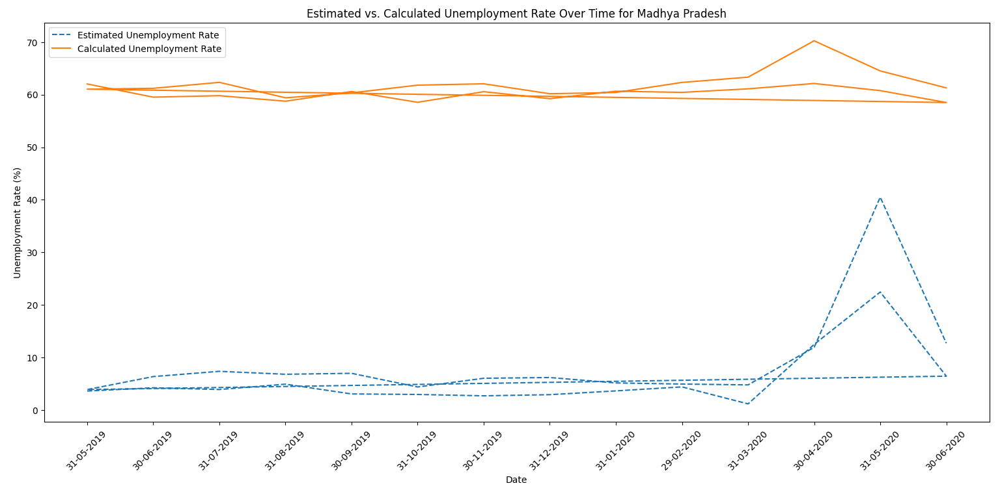

# CBTCIP

## Install Dependencies 

Run `pip install -r requirments.txt` from root directory.

# Task 1

## Problem Statement
Iris flower has three species; setosa, versicolor, and virginica, which differs according to their measurements. Now assume that you have the measurements of the iris flowers according to their species, and here your task is to train a machine learning model that can learn from the measurements of the iris species and classify them.

## Libraries used: 
- Pandas
- Seaborn
- MatplotLib
- Scikit-Learn

## Algorithm/Model used: 

k-Nearest Neighbors (k-NN) 

# Task 2 

## Problem Statement
Unemployment is measured by the unemployment rate which is the number of people who are unemployed as a percentage of the total labour force. We have seen a sharp increase in the unemployment rate during Covid-19, so analyzing the unemployment rate can be a good data science project.

## Libraries used:
- Pandas
- Matplotib
- Openpyxl

## Output Images:
1. Andhra Pradesh

2. Assam

3. Bihar

4. Chhatisgarh

5. Chandigarh

6. Delhi

7. Goa

8. Gujarat

9. Haryana

10. Himachal Pradesh

11. Jammu & Kashmir

12. Jharkhand

13. Karnataka

14. Kerala

15. Madhya Pradesh

16. Maharashtra

17. Meghalaya

18. Odisha

19. Puducherry

20. Punjab

21. Rajasthan

22. Sikkim

23. Tamil Nadu

24. Telanagana

25. Tripura

26. Uttar Pradesh

27. Uttarakhand

28. West Bengal

